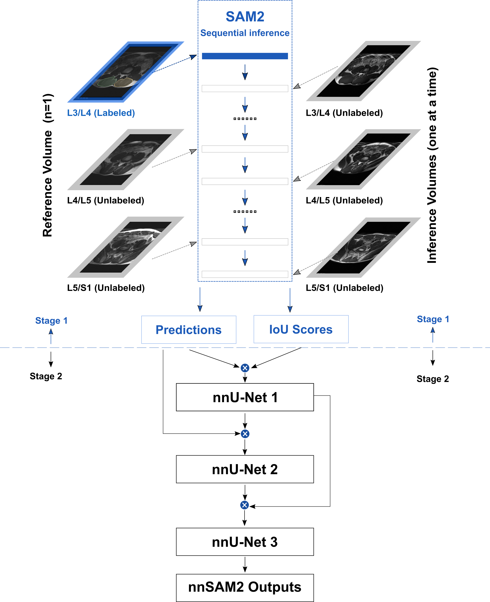

# nnSAM2

**nnU-Net-Enhanced One-Prompt SAM2 for Few-shot Multi-Modality Segmentation and Composition Analysis of Lumbar Paraspinal Muscles**

---

## 🔍 Method Overview

We present **No-New SAM2 (nnsam2)**, a framework that achieves **state-of-the-art performance** in few-shot, multi-modality lumbar paraspinal muscle (LPM) segmentation.  

  

Instead of introducing a new architecture or fine-tuning SAM2, the power of **nnsam2** comes from systematically integrating:  
- **SAM2** → broad generalization across modalities  
- **nnU-Net** → robust 3D contextual awareness  

Using only **6 labeled slices out of 19,439** (one per dataset), **nnsam2** demonstrated *statistical comparability* with expert manual references for:  
- **Muscle volume** (multi-sequence MRI, multi-protocol CT)  
- **CT attenuation**  (multi-protocol CT)
- **Fat ratio**   (Dixon MRI)

---

## ⚙️ Implementation Workflow

### 1. Region Extraction
- Select the **L4–L5 region** (from the L3/L4 to the L5/S1 disc level).  
- One representative slice per dataset is manually annotated.  
- Notebook: [img_intercept_L4-L5_github.ipynb](notebooks/img_intercept_L4-L5_github.ipynb)

---

### 2. nnsam2 Pipeline
The implementation of **nnsam2** follows a seven-step pipeline. All Jupyter notebooks are located in the `notebooks/` folder. For environment setup, please refer to the documentation:  
[`Implementation_steps_sam2.md`](documentation/Implementation_steps_sam2.md) 

**Step 1. NIfTI → JPG Conversion**  
- Convert 3D NIfTI images into 2D slice-wise JPGs (2-class masks).  
- Notebook: [step1_nii_2_jpg_2class.ipynb](notebooks/step1_nii_2_jpg_2class.ipynb)

**Step 2. Interleaved Slice Ordering**  
- Interleave slices from target and representative volumes (e.g., L4–L5 levels) to prepare for promptable segmentation.  
- Notebook: [step2_jpg_interleave.ipynb](notebooks/step2_jpg_interleave.ipynb)

**Step 3. SAM2 Segmentation with IoU Recording**  
- Run **SAM2** in batch mode on interleaved slices.  
- Generate 2-class segmentation masks and record IoU scores for confidence filtering.  
- Notebook: [step3_SAM2seg_in_batch.ipynb](notebooks/step3_SAM2seg_in_batch.ipynb)

**Step 4. Reconstruction into 3D NIfTI**  
- Convert SAM2’s slice-level JPG outputs back into 3D NIfTI volumes.  
- Preserve 2-class masks for later evaluation.  
- Notebook: [step4_SAM2seg2cls_jpg2nii.ipynb](notebooks/step4_SAM2seg2cls_jpg2nii.ipynb)

**Step 5. Top-Slice Selection by IoU**  
- Select the top slice(s) based on IoU scores.  
- Reconstruct NIfTI files using only validated slices for higher-quality pseudo-labels.  
- Notebook: [step5_selectTopSlice_jpg2nii.ipynb](notebooks/step5_selectTopSlice_jpg2nii.ipynb)

**Step 6. nnU-Net Training with High-IoU Pseudo-labels**  
- Train three sequential nnU-Net models, each initialized with pseudo-labels retained after filtering by IoU-based confidence scores and anatomical plausibility checks.  
- For details on nnU-Net training and evaluation, please refer to the [LPM_Segmentator Documentation](https://github.com/johnnydfci/LPM_Segmentator).

**Step 7. DSC-based Comparison**  
- Compute **Dice Similarity Coefficient (DSC)** between:  
  - nnU-Net stage outputs and SAM2 pseudo-labels  
  - Consecutive nnU-Net stages  
- Notebook: [step7_DSCcompare_nnsam2_stage2.ipynb](notebooks/step7_DSCcompare_nnsam2_stage2.ipynb)

---

### 3. Quantitative Analysis
- **Muscle Volume**: computed from MRI & CT segmentation masks  
- **Fat Ratio**: computed only from **Dixon MRI** (example code provided)  
- **CT Attenuation**: measured in Hounsfield Units (HU) from CT scans  

📓 Example notebook: [nnsam2_quant_analysis.ipynb](notebooks/nnsam2_quant_analysis.ipynb)

---

## 📥 Data Download

### 📊 Released Annotations
- **Back-pain patients (T2W MRI):** 411 scans, 6,784 slices  
- **Back-pain patients (T1W MRI):** 415 scans, 6,849 slices  
- **TotalSegmentator (CT):** 176 scans, 2,614 slices  
- **WORD (CT):** 100 scans, 1,218 slices  

**Total:** 826 MRI scans (13,633 slices) and 276 CT scans (3,832 slices).  

👉 [Download Annotations](https://drive.google.com/drive/folders/1zBKoy3cctG5pYEWl9EAqhEqMabw_BzTy) *(no password required)*  

---

## 🙏 Acknowledgment
We acknowledge that this work builds upon the following **public datasets**:  

- **Back-pain MRI** — [Mendeley Data](https://data.mendeley.com/datasets/k57fr854j2/2)  
- **TotalSegmentator (CT)** — [Zenodo](https://zenodo.org/records/10047292)  
- **WORD (CT)** — [GitHub](https://github.com/HiLab-git/WORD)  

Our contribution is the **manual segmentation of LPM** in these datasets, which were **not originally segmented for LPM** (with the exception of *TotalSegmentator*, where we re-segmented the muscles to improve label quality).

The nnsam2 framework integrates:  
- **[SAM2](https://github.com/facebookresearch/sam2)** — Segment Anything Model 2  
- **[nnU-Net](https://github.com/MIC-DKFZ/nnUNet)** — nnU-Net

## 📄 License

This project (code and released annotations) is licensed under the **GNU General Public License v3.0 (GPL-3.0)**.  
You are free to use, modify, and distribute this work, provided that any derivative works are also released under GPL-3.0.  

For details, see the [LICENSE](LICENSE) file.

---

## 📖 Publication
TBD
